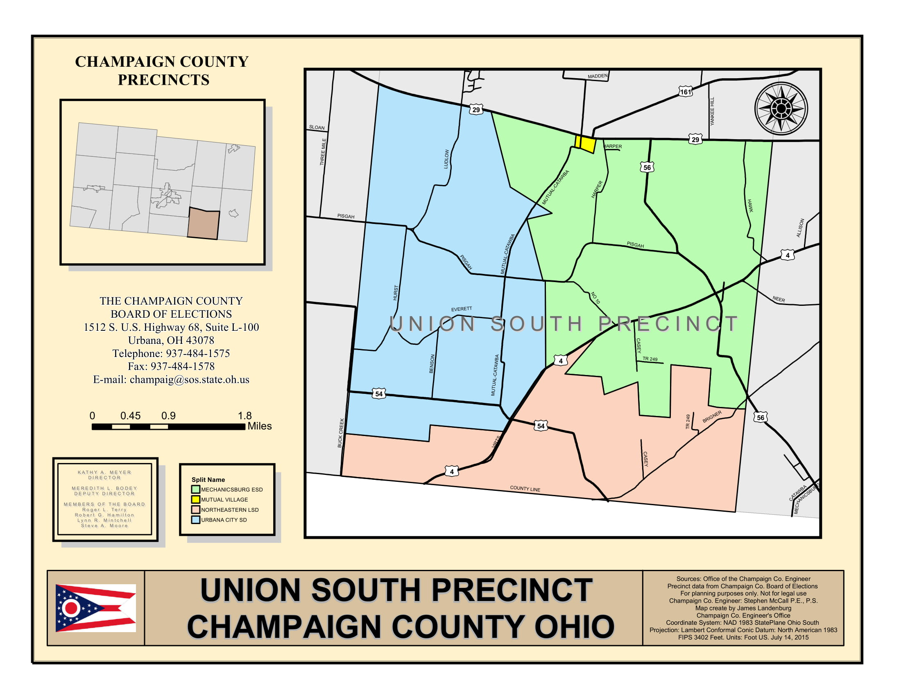
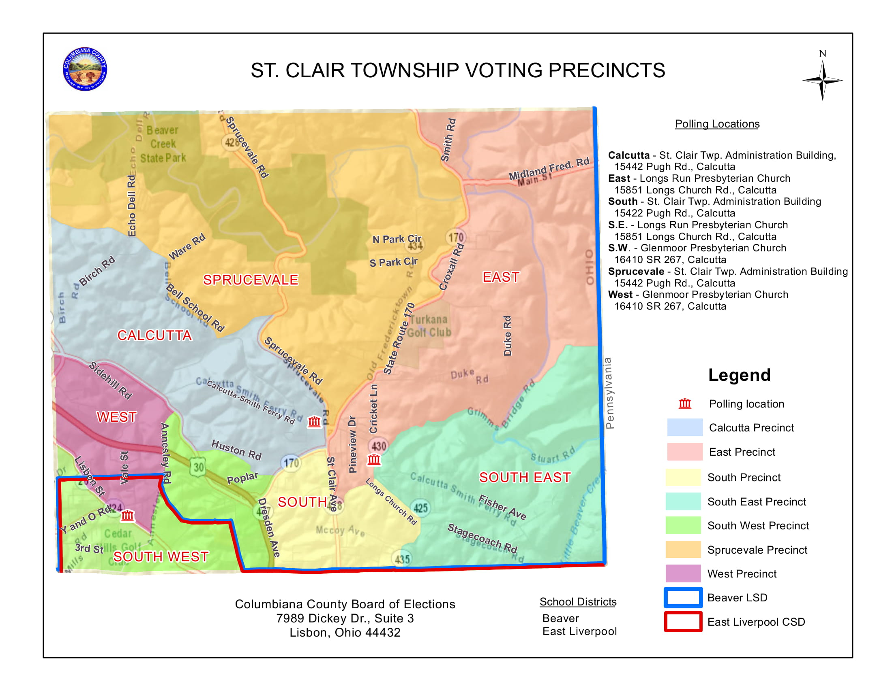

```{r include = FALSE}
library(tidyverse)
library(knitr)
library(kableExtra)
noble_geo <- read_csv("../R/data/geocoded/noble_geo.csv")
opts_chunk$set(echo = FALSE, message = FALSE, warning = FALSE, fig.width = 2, fig.height = 2, fig.align = "center")
```


# Creating an open-source precinct shapefile for Ohio {.tabset}

<br>
<br>

**Abstract**

<br>
<br>

Many people claim that political districts are gerrymandered, but how do we provide quantitative evidence? Modern gerrymandering research has employed computational methods to evaluate the fairness of political districting. In order to use these methods, we first need to collect detailed data on precinct boundaries. This process is not always straightforward. Not all states and counties provide “shapefiles” or even static maps that can be digitized (labor intensive work). My work aims to make the data gathering process more accessible for researchers and community members. 

With a team, I built an algorithm that approximates voting precinct boundaries from census blocks and the publicly available list of registered voters.  In short, this algorithm aggregates the census blocks assigned to the same precinct and applies a k-nearest neighbor model to determine the most likely precinct assignment.  I test this approximation against counties for which we have official shapefiles and  find that our approximation generally has greater than 90% spatial agreement with the official shapefiles. In conclusion, I present ideas for improving this model by utilizing other spatial features such as municipality boundaries and locations of major roads.

<br>
<br>


## Overview

<br>
<br>

On this site you'll find an explanation of the work that went into creating the first open-source precinct shapefile for Ohio. This project should be thought of as a work-in-progress, in part because precinct boundaries are constantly changing. That being said, if you come across errors in this site, please let [Katie](katiejolly6@gmail.com) know. 

This project has been a group effort by myself (Katie), Ruth Buck, Katya Kelly, Hannah Wheelen, and many other undergraduate and graduate fellows at the Voting Rights Data Institute from June to July 2018. 

<br>
**Site outline**
 <br> 
 
* Motivation for the project: An outline of the current status of voting rights in America

* Collecting publicly available data: The process we used to collect shapefiles and maps for each county in Ohio

* Approximating precinct maps: An algorithm we developed to fill in the gaps in our data using voterfile and census block data

* What can we do with this: Some ideas we have had about why someone might want precinct boundary data

* More resources: Resources that have been helpful to us along the way

<br>
<br>


<br>
<br>


## Motivation <br>for the project


### Why are precincts important for voting rights?

Precincts are the smallest unit at which election data are reported. Counties can also provide a coarse picture of election returns, but precincts give significantly more detail to the story.	In order to make nuanced arguments about the fairness of districts, we need to know about the [precinct boundaries](https://elections.nsgic.org/gis-places-voters-in-right-voting-district/).  

In the United States, precinct boundaries are left up to the county to decide. On the surface that is not a bad thing, but a problem arises when there is no central database for that information. Often the information isn’t digitized in an easily shareable way. In my ideal world there would be a centralized repository of shapefiles that is required to be updated whenever there is a boundary change. However, we are pretty far from that in terms of data capacity, and I realize that’s a larger problem than just precinct boundaries. 

Recently in the news, with the election and decennial census approaching in 2020, there has been a resurgent interest in [polling place accessibility](https://www.nytimes.com/2018/08/23/us/randolph-county-georgia-voting.html), [voter registration campaigns](https://www.tennessean.com/story/news/politics/2019/04/15/tennessee-bill-critics-criminalize-incomplete-voter-registration-efforts-tre-hargett/3478903002/), and (sometimes hidden) [voter disenfranchisement](https://www.houstonchronicle.com/local/gray-matters/article/voting-rights-convicted-felons-harris-county-13751374.php). The Supreme Court also recently upheld Ohio’s practice of [purging inactive voters](https://www.dispatch.com/news/20181120/ohio-voter-roll-purges-beginning-again-after-husted-directive) from the voter rolls. Many of the most pressing voting rights challenges require precise knowledge of where polling places are and who is using those polling places, as well as which voters are affected by new policies.


This project aims to make it easier for community members to learn more about their own precincts and create one way for people to support concerns about equity and fairness with numbers. We focus on Ohio, but we hope our methodology can be repeated in other states as well and support the work of groups working on similar research. 


## Collecting publicly <br> available data 

<br>
<br>

### Related posts

[Map digitizing guide](http://www.katiejolly.io/portfolio/digitizing-guide/)

### Setting up the data collection

we started with a list of the 88 counties in Ohio and a group of about 10 researchers. For each county we looked online for a publicly available shapefile. Around 30 had shapefiles up-front. Counties fell into one of four categories: had a shapefile, had a web map, had a PDF map, had nothing available (at the time). 
After the initial internet search, we called the county Board of Elections and/or a secondary county official (a GIS specialist, for example). Our conversations with them depended on what information we had available to us already. For counties with shapefiles, we asked when that particular plan was adopted and if they had access to any previous plans’ shapefiles. For counties with a web map as the best option, which was fairly uncommon, they were almost always able to send the underlying shapefile, as well as answer all of the usual shapefile questions. Counties that had only PDF maps available online either said that the PDF was the best and only option or had a shapefile that just had not been released online, often due to a lack of strong GIS infrastructure. 


The last and most difficult category were those counties that had nothing available online. Those calls went one of three ways. First, they would be able to send us a PDF or shapefile, which was the best situation. Second, and more likely, they were able to mail us a hard copy of a map. These were often paper maps or highway maps that had precinct boundaries drawn by hand with markers. Third, and slightly less likely, they really had no maps they were able to give us. These counties were generally small and rural, although some were surprisingly populated. Fourth, the county officials never answered the phone after repeated attempts or hung up on us. That only happened in one or two counties, though. 
The counties that had no maps were the interesting ones.I will discuss more in depth how we handled drawing precincts for those counties in the [Approximating precinct maps section](#approximating-precinct-maps). Ultimately we used geocoding and the addresses listed in the voterfile to approximate the boundaries.


In total, we were given shapefiles from 50 counties, PDF or paper maps from 31 counties, and no maps from 7 counties. The next few sections describe our methodology for each of the cases. Note that for counties that provided a shapefile, often the only work on our part was creating a projection file when one was not already included so I do not discuss that methodology in this paper. 


### Digitizing maps

In this section I refer to digitizing as the full process including both georeferencing and vectorizing.
Among counties that provided us with PDF or paper maps, there was a wide range of quality and quantity. Some counties had a single PDF map of all the precincts whereas other counties had one precinct per PDF, which could be as many as 100 or so. Other counties mailed us paper maps, which also had a wide range of quality. There were even counties that split precincts among several PDFs. To digitize we used OpenStreetMap in QGIS. 

There were approximately 450 total images to digitize. We hosted “digitizing workshops” and invited everyone at the research institute to attend with the promise of a free dinner and new technical skills. At the first one, I led a short lesson on georeferencing and map projection. We also made a step-by-step guide for georeferencing that was specific to these maps. Some images from the guide are shown below.


During the second workshop we started vectorizing the georeferenced maps. This was prone to a few more technical issues, including difficult angles and fine-tuning. Due to time constraints we vectorized by selecting census blocks that were within the precincts because in most places, precinct lines followed census blocks. From a project management standpoint we usually assigned the georeferencing of a county to a group of two to four people and then assigned only one person for the vectorizing. This helped minimize opportunities for human error. 


In total we estimated that we spent about 400 person hours on the project. Some of that time comes from the fact that many people had never used GIS before and we had to redo a few counties. In general, it’s a long and tedious process. As of now, by hand seems to be the only viable option. However, in the next section I will discuss an algorithm that was originally designed to impute missing data but the hope is that we could automate some of the digitizing in the future as well. 

<br> 
<br>

### Map examples

<br>
<br>



<br>




<br>
<br>


## Approximating <br>precinct maps

<br>

### Related posts

[Writing a classification algorithm to build precinct shapefiles in Ohio](http://www.katiejolly.io/blog/2018-10-04/ohio-precinct-classification)

[Evaluating our precinct boundary approximation algorithm with v-measure](http://www.katiejolly.io/blog/2018-10-27/vmeasure-ohio)

<br> <br>

Most of the counties were cases where they either a shapefile available or pdf maps that we could digitize. The more challenging case was when no map existed that we could use. There were about ten counties in this category. Much of our research was related to how to use other publicly available data to approximate the precinct boundaries in these counties. In the end we found that geocoded addresses from the [publicly available voter file](https://www6.sos.state.oh.us/ords/f?p=111:1) could draw “accurate-enough” precinct boundaries in the absence of a better option. Though groups like the National States Geographic Information Council (NSGIC) are also using voter addresses to geocode precinct boundaries with address range shapefiles, their methods are not publicly available. Our general approach is to use the voter file to find the locations of currently registered voters and then triangulate plausible precinct boundaries using a nearest neighbor algorithm. The details of this algorithm are below. To illustrate the algorithm, we use Noble County, Ohio as an example. 

### Data

The first consideration is the readily available raw data that is available to researchers and community members. Calling counties for more data is an option, though a time consuming and tedious process. The ultimate goal is to make phone calls less necessary for obtaining data. 

The publicly available voter files, a list of the registerested voters, are compiled by county. So in total, there are 88 voter files for Ohio. Included are variables like an address and the assigned precinct. An example of the voter file for Noble county is shown below:

```{r echo = FALSE}
kable(noble_geo %>% select(RESIDENTIAL_ADDRESS1, RESIDENTIAL_CITY, RESIDENTIAL_STATE, RESIDENTIAL_ZIP, PRECINCT_NAME) %>% head()) %>%
  kable_styling(bootstrap_options = c("striped", "hover", "condensed", "responsive"), full_width = F, font_size = 10)
```

The other piece of data we need to approximate the precinct boundaries is an underlying geographic unit for building the precincts. The natural choice is census blocks because in theory precinct boundaries do not split census blocks. Additionally, the method of digitizing we implemented uses census blocks to fill in precinct polygons. Census blocks are the smallest geographic unit defined by the Census Bureau. In urban areas, census blocks are often analagous to city blocks, but this analogy does not hold in rural areas. The tigris package in R (Walker, 2018) to accesses the census block shapefiles published by the Census Bureau for us. Below is an image of how precincts and census blocks fit together. We can see the smaller units, census blocks, fitting into the larger unit, the precinct. 

<br>
<br> 


<br>
<br>

To connect the voter file with the census blocks, we make use of a Census Bureau API through the tigris package in R (**cite!!**) that returns a census block ID for each valid address. In general, we find that 60 to 80 percent of the addresses are valid, meaning they can be processed by the API. Below on the left is a map highlighting the census blocks with no valid addresses and on the right is a map showing how many addresses are valid per census block. 

<br>
<br>


<br>
<br>


### Defining a model

For the blocks with valid addresses, the voter file contains information about what precinct that address belongs in. We define the precinct of a block with valid addresses to be the most common precinct of the listed addresses. Often these are unanimous, but in scenarios with data entry errors, split blocks (blocks that contains voters in multiple precincts), or other irregularities there may be multiple precincts listed in a block. This leaves slightly fewer than half of the census blocks unclassified in most counties. 

The idea behind our approximation method is to use nonparametric classification to impute the missing block precinct assignments. The initial idea comes from Tobler's first law of geography, "everything is related to everything else, but near things are more related than distant things." In this context, adjacent blocks are more related than non-adjacent blocks in terms of precinct assignment. This is true conceptually, but also many states require precincts to be contiguous polygons. We can formalize this idea with a k nearest neighbor model  where k is a function of the particular block. 

We define this model as a nearest neighbor model that depends on the number of adjacent neighbors of a given block $x_i$, of $I$ total blocks in a county. The general framework is similar to a $knn$ model, where $k$ = the size of the neighborhood. Different blocks have different numbers of adjacent neighbors, thus thus the neighborhood size is a function of the block. $N(x_i)$, the neighborhood of block $x_i$ is defined by a rook-contiguity structure. This means that a block is considered a neighbor if it shares more than one point (more than just a corner adjacency). Alternatively, it is also common to define a queen-contiguity structure, allowing for corner adjacencies. In this model $k(x_i)$ is defined as the size of the neighborhood $N(x_i)$ of a given block $x_i$. 

From our set of $L$ possible precincts, the predicted precinct $\hat{p}_{k(x_i)}$ of a block $x_i$ is the most common precinct in its neighborhood of size $k(x_i)$, where $y_{ij}$ is the precinct assignment of the $jth$ neighbor of the $ith$ block. The number of neighboring blocks in precinct $p_l$ is defined by $N_l(x_i)$. Ties for the most common precinct are broken at random. Specifically:


$$\hat{p}_{k(x_i)} \in \text{argmax }N_l(x_i), \quad l \in \{1, 2, 3, ... L\}$$ 

$$\text{where } N_l(x_i):= \sum_{j=1}^{k(x_i)}\mathbf{1}(y_{ij}=p_l)$$

After we run this model, there will still be unclassified blocks. This comes from the fact that not every unclassified block has classified neighbors. This then becomes an iterative model. The process is repeated until every block is classified. Blocks classified in previous iterations become part of the training set, so each iteration has more training data than previous ones. 

If we wanted a nondeterministic model instead of this deterministic one, we could define the probability of block $x_i$ being in precinct $p_l$ as the fraction of its neighbors in that precinct. This model, as written, is deterministic because it gives only one precinct name for each block. The one precinct name is the most likely precinct name. To make it nondeterministic, instead of only looking for the most likely precinct name, we could involve more decision-making on the part of the user by giving the probability of each precinct name for a given block and allow the user to choose from that list of probabilities. The probability of a precinct name for a given block could be defined as the percent of its neighbors that are in that precinct. Doing the classification in a nondeterministic way would give more leverage to the user to make judgement calls based on outside information sources that are often correlated with precinct boundaries, like the location of major roads or municipal boundaries. Along with allowing the integration of outside information provided by the user, there are other changes we can make to our algorithm that allow for more flexibility. As an improvement to the original model definition, we can include a requirement that a minimum fraction of a block's neighborhood, $\alpha$ must be classified in order to make a classification decision. This condition is supplied by the user. In this case, our model becomes:


$$
\begin{split}
\textbf{if: } & \quad \frac{\sum_{j = 1}^{k(x_i)}\mathbf{1} (y_{ij} = NULL)}{k(x_i)} \geq \alpha \\
& \quad \hat{p}_{k(x_i)} \in \text{argmax }N_l(x_i), \quad l \in \{1, 2, 3, ... L\} \\
& \quad \text{where } N_l(x_i):= \sum_{j=1}^{k(x_i)}\mathbf{1}(y_{ij}=p_l) \\
\textbf{else: } &  \\
& \quad \hat{p}_{k(x_i)} = NULL
\end{split}
$$

This process helps to mitigate spurious patterns in the classification that arise from having too little data about a block's neighborhood. Adding a minimum value that is too high prevents the algorithm from converging, or running to completion in some cases. Finding a balance is often a process of trial and error.

Once each block has a predicted precinct classification, we have the necessary information to build precinct boundaries. We use a [*dissolve*](https://pro.arcgis.com/en/pro-app/tool-reference/data-management/dissolve.htm) operation to aggregate blocks with the same precinct name. Dissolving is an operation that finds polygons (in this case, census blocks) that share a common attribute and then combines them into a larger polygon made of up the smaller parts. Here we dissolve on the precinct name, so we create larger precinct polygons made up of the census blocks as the base units. This then allows us to have a complete shapefile of the voting precincts in a county, which was our initial goal. In the next section, I will discuss some techniques for conducting a sensitivity analysis to find a balance between the strictness of our algorithm and the convergence of the approximation. 

### A simplified example

In this section I will walk through how this algorithm works for one particular block. We can image a region with nine census blocks. To walk through the process we will classify the center block of this area. For simplicity's sake, we will assume that this area has only two possible precincts: blue or purple.

<br>
<br>


<br> 
<br>

We start this process with the addresses of registered voters. We can then use the census API to get the census block ID for each voter. We also know the precinct of each voter, color-coded on the diagram below.

<br>
<br>


<br>
<br>

With this information, we can classify the blocks with registered voters to one of the two precinct color codes we have here. This classification is based on the most common precinct of the voters in that block. In cases where we see multiple precincts in one block (as in the top right block), we use "majority rules." 

<br>
<br>


<br>
<br>

We now have the necessary information to classify the center block (our block of interest). We start by defining the **rook neighborhood**. This neighborhood is defined as any block that shares multiple points (for example, it cannot just touch on the corner). Below you will see the highlighted rook neighborhood for the center block. 

<br>
<br>


<br>
<br>

We then count the number of blocks in the neighborhood of a given precinct. There are $2$ in the blue precinct and $1$ in the purple precinct. When we find the most common precinct, we disregard the NULL blocks. In this case, the most common precinct is **blue**. We have not set any restriction on the minimum proportion of blocks in the neighborhood that have to be classified, so we do not have to check that value. Below you will see a diagram with this classification made for the center block. 

<br>
<br>


<br>
<br>

In practice, we do not focus only on one block at a time. Rather, we look at any unclassified block that has unclassified neighbors. To do that, we simply extend this process to look at many blocks at once. 

### Checking model quality

<br>
<br>

#### Conducting a sensitivity analysis

One question that we had was how robust the algorithm was to changes to the minimum required neighbors. We tested the algorithm $\alpha \in \{0, 0.25, 0.35, 0.4, 0.5, 0.8\}$ to see how the maps might change with different minimum proportions set for classification. We expected that a value somewhere in the middle of the set would be best. 

In general we found that $\alpha > 0.25$ was too strict in this particular county (Noble). There would be a point at which there were no unclassified blocks that met the requirements and the percent classified would reach a horizontal asymptote (see figure below). However, in other counties the "maximum minimum" proportion could be different. The best method is to try a variety in each context. Below is a plot illustrating this phenomemon. Each line on the plot follows the path of the classification at different values of $\alpha$ and it measures the number of census blocks in the county that are still unclassified after that iteration, Iteration number can be found on the x axis. For example, the yellow line illustrates what happens when we set the minimum proportion to 0.8, or 80 percent of a block's neighborhood has to be classified in order to classify it. In particular, notice that after a sharp initial drop (though less sharp than the other lines), it plateaus at about 800 blocks still unclassified after the first iteration. Meanwhile, the gray line shows what happens when we make no requirements for a block's neighborhood prior to classification. We see a very sharp drop after the first iteration and it continues to drop until all of the blocks are classified after the sixth iteration. The lines in the middle are intermediate minimum values between our two extremes. In this particular example, notice that only the green and gray lines reach $y=0$, or converge to a completed approximation. It's hard to see in this particular view, but all of the other lines reach horizontal asymptotes where they cannot continue classifying any further. Future research could investigate the impact of using a stricter $\alpha$ value until reach an asymptote and then loosening the requirements to allow it to proceed.

<br>
<br>
<br>


<br>
<br>
<br>

We can also look at this process in detail for certain minimum proportions. Below are some maps that help detail this process. This set of maps corresponds to the convergence process when $\alpha = 0$. These maps show a view of what is actually happening at each point on the line plot above for one particular line. For example, between the initial map and the first iteration we see the sharp decrease in the number of unclassified blocks that we saw on the plot above. To see the maps for the other values plotted on the above graph, please see the **Appendix: Figures** section at the bottom of this page.  


<br>
<br>
<br>
<br>

#### Assessing model accuracy

<br>
<br>


After defining and implementing a model for imputing precinct names, we want to have a method for evaluating these maps. Two factors make this more complex. First, we do not have true values for the counties that did not provide data. We also needed an assessment built specifically for spatial qualitative response variables.

In order to have "true" values to which to compare our approximations, we independently generated precinct maps for counties that did provide data. Using multiple counties allowed us to have an idea of the spread of possible accuracies. To compare the maps we use a spatial validity measure, or v-measure. The paper on using v-measure for spatial data by Nowosad and Stepinski is [freely available online](https://eartharxiv.org/rcjh7/) and also has an accompanying [blog post](https://nowosad.github.io/post/sabre-bp/). V-measure evaluates the “sameness” of the different precinct labels, or how well two different precinct maps fit together in one domain (a county). For simplicity, we refer to the official precinct boundaries as a regionalization and the approximate boundaries as a partition (and the individual units of the partition are the zones). We compute values for completeness, the average “sameness” of the regions with respect to zones, and homogeneity, the average “sameness” of zones with respect to regions. The v-measure is a harmonic mean of completeness and homogeneity and ranges between 0 and 1, with 1 being a perfect match. The methodology for v-measure is defined below. 

We will call the county, our area of interest, $A$. The regionalization $R$, the official precincts, divides $A$ into $n$ regions $r_z | z = 1, 2, 3, ..., n$. The partition $W$, our approximated precincts, divides $A$ into $m$ zones $w_y | y = 1, 2, 3, ..., m$. We superimpose the regionalization and partition to subdivide the domain into $m x n$ units, having areas $a_{zy} | z = 1, ..., n; y = 1, ..., m$. In this case, $a_{zy}$ is the area of the intersection of region $z$ and zone $y$. 

Inhomogeneity of the partion with respect to the regionalization can be written out generally as: $$\sum_{y=1}^m(\frac{A_y}{A})\frac{\text{variance of regions in zone y}}{\text{variance of regions in the domain}}$$

This is essentially a weighted sum of the ratios of variances, or how inhomogenous a zone is in terms of the regions compared to the whole domain. We can measure the variance of the regions in zone $y$ in terms of the Shannon entropy $S$. 

$$S^R_y = -\sum_{z=1}^n \frac{a_{zy}}{a_y}\text{log}\frac{a_{zy}}{a_y}$$

This value will be 0 when zone $j$ is completely homogenous, or contained in a single region. The value increases as zone $j$ is subdivided across more regions. In order to compare the inhomogeneity of a particular zone with the inhomogenity of the region (to be able to say whether or not that zone is more or less inhomogeneous than expected given the context of the map), we can also find the dispersion of regions across the whole domain with the Shannon entropy.

$$S^R = -\sum_{z = 1}^n\frac{A_z}{A}\text{log}\frac{A_z}{A}$$

We can calculate the inhomogeneity of partition with respect to regionalization across the domain as an area-weighted average of the $\frac{S_z^R}{S_R}$ ratios. These values can range from 0 in the perfectly homogenous case where every zone is nested in only one region to 1 where a zone is spread across all regions of the domain. Inhomogeneity can be difficult to conceptualize, though, so we find homogeneity $h$ instead.

$$h = 1 - \sum_{y=1}^m(\frac{A_y}{A})\frac{S^R_y}{S^R}$$

Homogeneity is only one view of spatial agreement between the two maps. You can think of an extreme case where there is only one region that covers all of the zones. There will be perfect homogeneity (each zone is contained by only one region), but there is no reason to say the maps are spatially associated. If we think of association from the perspective of that one region, it is broken up across all zones and thus would give a 0 for homogeneity. 

The analagous measure for homogeneity of the regionalization with respect to the partition is completeness $c$. The calculation is the same as homogeneity, but the placements of zones and regions in the equations are switched. The process is detailed below.

$$S^W_z = -\sum_{y =1}^m\frac{a_{zy}}{A_z}\text{log}\frac{a_{zy}}{A_z}$$

$$S^W = -\sum_{y = 1}^m\frac{A_y}{A}\log\frac{A_y}{A}$$

$$c = 1 - \sum_{z=1}^n(\frac{A_z}{A})\frac{S^W_z}{S^W}$$

Possible values of completeness follow an analagous pattern to those for homogeneity. We then compute the harmonic mean of homogeneity and completeness with an optional weighting parameter $\beta$ that can give more or less weight to either value. There are feasibly scenarios in which homogeneity or completeness may be more important, but in this context we weight them equally, setting $\beta = 1$. When $\beta > 1$ for example, completeness is given more weight than homogeneity. The opposite is true when $\beta < 1$.  V-measure $V_\beta$ can range from 0 to 1, same as homogeneity and completeness individually. When $V_\beta$ = 0, that indicates no spatial association, or agreement, between the two maps. Alternatively, when $V_\beta = 1$, we say there is perfect spatial agreement between the two maps. 

$$V_\beta = \frac{(1 + \beta)hc}{(\beta h) + c}$$

Even though $V_\beta$ only gives a global measure of association, implied in these equations are the local measures of association as well. We can map the ratios $\frac{S^W_z}{S^W}$ and $\frac{S^R_y}{S^R}$ to see local association from both perspectives. To further check the robustness of our algorithm to different minimum proportion values, we can calculate V-measure for maps produced at different thresholds for the same county and compare the degree of spatial association. Even though we are not ultimately looking to approximate the counties for which we already have data, and thus can calculate V-measure, this process helps us learn more about how the algorithm is working in the general case. Additionally, we can compare different approximations to each other to find where local inhomogeneity is highest, or where we see the biggest changes due to threshold specification. 

To demostrate how we use v-measure, I will use Clark County as an example. For this county, we were given official precincts by the county. We also generated our own approximations using our model. 

<br>
<br>


<br>
<br>

Counties like Clark help validate our method by telling us how closely our approximations match the actual map. It is not necessarily a definitive measure, but it can be used to give a general idea of model adequacy. 

Intitially we implemented a precinct approximation model defined by $\alpha = 0$, meaning only one neighbor has to be classified to classify a block. When we calculated v-measure, we got an overall completeness of $0.95$ and homogeneity of $0.96$, giving the overall V-measure of $0.95$. This can be interpreted as there is a 95% spatial agreement between our two maps. V-measure also calculates local inhomogeneity, which gives an idea of exactly which $a_{zy}$ units are the most inhomogeneous, or poorly approximated according to this measure. First, we can look at local inhomogeneity from the perspective of the official precinct boundaries.

<br>
<br>


<br>
<br>

Similarly, we can visualize the distribution from the perspective of the approximated map. 

<br>
<br>


<br>
<br>

When we look at these maps, we see a few spatial patterns. First, we see a line of inhomogeneity through the middle of the county. From outside research we know that this line tracks with a major highway. 

The spatial autocorrelation of our errors suggests latent patterns that our model cannot account for. Being able to identify covariates, such as the presence of the highway, adds to the information we have about what those latent variables might be. In this case, we know from prior knowledge that precinct boundaries often follow major roads or municipal boundaries. Through the census we can access this data. In future versions of the algorithm, we hope to include mechanisms for accounting for updating the probability that blocks are in the same precinct according to this outside information about other spatial patterns. 

In summary, there are two points to be made with respect to model quality. First, if we require more of a block's neighborhood to be classified, there is a point after which we cannot continue to classify blocks. This means we need to find an intermediate value to allow for some caution without being overly conservative in our approximation. 

Second, this method does reasonably well with respect to inhomogeneity and completeness. We see more errors in urban areas than in rural ones. We hypothesize that this is because urban precincts tend to be more complex, and those complexities are hard to capture with the current process. 


### Suggested workflow

After the release of our upcoming R package `{approxprecincts}`, anyone will be able to implement the approximation algorithm. We currently do not implement v-measure code in our package, because the `{sabre}` package already does that well. Below I will demonstrate the general workflow for any Ohio county. Take note that the geocoding function speed is highly dependent on the number of voters registered in a county. We are yet to test how well random samples of voter addresses perform relative to the whole set, but that is something worth exploring for the sake of convergence and robustness.

This example is for Noble County, but the process is similar for any Ohio county.

We start by initially just creating the first iteration.

```{r eval = FALSE, include = TRUE, echo = TRUE}
county_voterfile <- load_voterfile(county = "Noble")

county_blocks <- load_blocks(county = "Noble")

voterfile_geo <- geocode_voterfile(county_voterfile)

iter_1 <- voterfile_geo %>%
  join_voters_to_blocks() %>% # matches up voters with census blocks based on the geocoding process
  find_neighbors(type = "rook") %>% # creates a vector of neighbors for each block, can be rook or queen adjacency
  lookup_precincts_nn() %>% # creates a vector of precinct names with a name for each neighbor
  classify_nn(alpha = 0) # finds the most common precinct name, if at least the minimum proportion is met
```

After the first iteration is complete, we no longer need to look up the neighbors of each block anymore. We only need to start the process with updating the vector of precinct names to update our information about the map. 

```{r eval = FALSE, include = TRUE, echo = TRUE}

iter_2 <- iter_1 %>%
  lookup_precincts_nn() %>%
  classify_nn()
```

We repeat this process until all the blocks are classified. The function will print a message telling the user how many blocks are left after each iteration, to give an idea of performance over time. 

### Appedix: A reproducible process

If you would like to reproduce these maps, or produce them for your own work, we have compiled this algorithm into an R package. You can install it from the [GitHub repository](https://github.com/ykelly/approxprecincts) as it is not available on CRAN. 

### Appendix: Figures

**Convergence of algorithm when $\alpha = 0$**


**Convergence of algorithm when $\alpha = 0.5$**


It is hard to see from the static maps but there is no change from the 14th to the 15th iteration, meaning the process will not eventually converge to a completed map. In this case, the minimum proportion is too strict. 


## What can we <br>do with this?

<br>
<br>

With the 2020 census and election approaching, there has been an [increased interest](https://prospect.org/article/can-open-data-save-redistricting-reform) in open precinct data. This project presents one way to make the process easier. I argue that there are a few reasons that you might prefer this approximation over other more exact alternatives.

1. For states with publicly available voterfiles, the approximation is much less labor and cost intensive than phone-banking county Boards of Elections.

2. Computationally drawing precinct boundaries allows the process to be reproducible. This is helpful both for verifying your work and for updating it in the future.

3. Drawing precincts directly from census geographies allows for a more intuitive spatial joining of demographic variables for further analysis.

4. Another benefit of drawing the precincts directly from census geographies is that there is a high level of confidence in the quality of census shapefiles. That level of confidence is not nearly as high for every county's shapefiles. 

5. It does not hurt to have multiple ways to approach a problem (in this case, collecting precinct data). 

## More resources

<br>
<br>

### Related posts 

[GIS/LIS Conference Presentation Resource Page](http://www.katiejolly.io/honors-project-ohio/)

<br>
<br>

This group is certainly not the only one working on voting rights and data science for social good. Here is a starting list of other organizations and resources to know about if you're interested in this work!

* [Changing the math on gerrymandering by Olivia Walch](https://thenib.com/changing-the-math-on-gerrymandering)

* [Metric Geometry and Gerrymandering Group](https://mggg.org/)

...

## Code


**Code to reproduce the Noble County shapefile**

You can adapt this code to any other Ohio county by starting with a different voterfile link. 

This code is written in R using the tidyverse ([tidyr](https://tidyr.tidyverse.org/), [dplyr](https://github.com/tidyverse/dplyr), [ggplot2](https://ggplot2.tidyverse.org/)), [tigris](https://github.com/walkerke/tigris), and [sf](https://github.com/r-spatial/sf) packages.


```{r eval = FALSE, include = TRUE, echo = TRUE}
# setting up the libraries and data

library(tidyverse)
library(tigris)
library(sf)

noble <- read_csv("https://www6.sos.state.oh.us/ords/f?p=VOTERFTP:DOWNLOAD::FILE:NO:2:P2_PRODUCT_NUMBER:61") # download the voterfile for Noble County


noble$GEOID10 <- NA # initialize an empty column

# the call geolocator function takes the address, city, and state as individual columns and sends them as a request to the census bureau API

vec <- purrr::map_chr(1:nrow(noble), function(i) tigris::call_geolocator(noble[['RESIDENTIAL_ADDRESS1']][i],
                                                                         noble[['RESIDENTIAL_CITY']][i],
                                                                         noble[['RESIDENTIAL_STATE']][i]))
```

```{r eval = FALSE, include=TRUE, echo=TRUE}

# helper functions

st_rook = function(a, b = a) sf::st_relate(a, b, pattern = "F***1****") # find rook-contiguity neighbors

lookup_precinct <- function(index, precinct_name_var = "PRECINCT_NAME"){ # for a given row index, find the precinct name
  precinct <- precincts_nb[index, precinct_name_var]
  return(precinct)
}

create_precinct_vector <- function(){ # create a vector of precinct names from lookup_precinct
  prec <- purrr::map(precincts_nb$NB_ROOK, lookup_precinct)
  prec_vec <- purrr::map(prec, dplyr::pull)
  return(prec_vec)
}


clean_precincts_fun <- function(i){ # clean the precincts, take out NA values
  y <- precincts_nb_sub$precinct_nn[[i]]
  print(y)
  new_y <- y[!is.na(y)]
  return(new_y)
}
#################################################

# Use this function to assign 2010 census blocks to a particular precinct based on the most common precinct assignment of the voters geotagged there.

join_voters_to_blocks <- function(voters, blocks, block_geoid_voters = "BLOCK_GEOID", precinct_name = "PRECINCT_NAME"){
  colnames(voters)[colnames(voters)==block_geoid_voters] <- 'BLOCK_GEOID'
  colnames(voters)[colnames(voters)==precinct_name] <- 'PRECINCT_NAME'
  precincts <- voters %>%
  #   # mutate(BLOCK_GEOID = as.character(!! block_geoid_q)) %>%
  #   # rename(PRECINCT_NAME = (!! precinct_name_q)) %>%
    group_by(BLOCK_GEOID, PRECINCT_NAME) %>% # for each block, precinct combination
    summarise(c=n()) %>% # counts the number of times a precinct is counted for a particular block
    filter(row_number(desc(c))==1) # dataframe of precincts from voterfile, takes the most common precinct assignment for a block
  
  precincts_geo <- blocks %>%
    # mutate(GEOID10 = (GEOID10)) %>%
    left_join(precincts, by = c("GEOID10" = "BLOCK_GEOID")) %>% # combine precincts with block shapefile
    mutate(dimension = st_dimension(.)) %>%
    filter(!(is.na(dimension))) # take out empty polygons
  
  return(precincts_geo)
  
}

# Assign a neighborhood to each block

find_neighbors <- function(x, type = "rook"){
  if (type == "rook"){
    NB <- st_rook(x)
  } else if (type == "queen") {
    NB <- st_queen(x)
  } else {
    stop("Please enter 'rook' or 'queen' for neighbor type")
  }
  x$NB <- NA
  for (i in 1:length(NB)){
    x$NB[i] <- NB[i]
    x$NB_length[i] <- length(x$NB[[i]])
  }
  
  
  return(x)
}

# Lookup the precinct names of each block in a neighborhood.


lookup_precincts_nn <- function(x){
  precinct_nn <- list()
  
  for (i in 1:nrow(x)) {
    precincts <- c()
    
    for (y in x$NB[[i]]){
      precincts <- c(precincts, x[[y, 'PRECINCT_NAME']])
    }
    
    precinct_nn[[i]] <- precincts
    
  }
  
  x$precinct_nn <- precinct_nn
  
  for (i in 1:nrow(x)){
    x$na_length[i] = sum(is.na(x$precinct_nn[[i]])) # count the number of NAs
  }
  
  x$percent_nn_preclassified <- 1 - ( x$na_length / x$NB_length)
  
  
  return(x)
  
}

# Classify any unassigned block with the most common precinct name of the rook-neighborhood.

classify_nn <- function(x, alpha = 0){
  
  x <- x %>%
    mutate(less_than_alpha = percent_nn_preclassified < alpha) # percent of neighbors is less than the required number
  
  precincts_nb_sub <- x %>%
    filter(!is.na(precinct_nn),
           !identical(precinct_nn, character(0)),
           less_than_alpha == FALSE) # take out blocks with not enough classified neighbors
  
  clean_precincts_fun <- function(i){
    y <- precincts_nb_sub$precinct_nn[[i]]
    new_y <- y[!is.na(y)]
    return(new_y)
  }

  p_new <- map(1:nrow(precincts_nb_sub), clean_precincts_fun)
  
  p_lengths <- map(1:length(p_new), function(x) length(p_new[[x]]))
  
  
  
  precincts_nb_sub <- precincts_nb_sub %>%
    mutate(precinct_nn_clean = p_new,
           precinct_nn_length = p_lengths) %>% # finds the number of classified neighbors
    filter(precinct_nn_length > 0)# take out the blocks without meaningful neighbors
  


  for (i in 1:nrow(precincts_nb_sub)){
    precincts_nb_sub$PRECINCT_NAME[i] <- ifelse(is.na(precincts_nb_sub$PRECINCT_NAME[i]), 
                                                names(which.max(table(precincts_nb_sub$precinct_nn[[i]]))), 
                                                precincts_nb_sub$PRECINCT_NAME[i])
  } # assign a precinct as the max of the vector of precincts
  
  precincts_nb_full <- x %>%
    left_join(precincts_nb_sub %>% st_set_geometry(NULL) %>% select(GEOID10, PRECINCT_NAME), by = "GEOID10") %>%
    mutate(PRECINCT_NAME.x = if_else(is.na(PRECINCT_NAME.x), PRECINCT_NAME.y, PRECINCT_NAME.x)) %>%
    select(-PRECINCT_NAME.y) %>%
    rename(PRECINCT_NAME = PRECINCT_NAME.x)
  
  message(paste0("There are ", sum(is.na(precincts_nb_full$PRECINCT_NAME)), " unclassified blocks."))
  
  return(precincts_nb_full)
}

```

```{r eval = FALSE, include = TRUE, echo = TRUE}
# run the classification for noble county iteratively

# get the census block shapefile first

blocks <- tigris::blocks(state = "OH", county = "Noble")

blocks_sf <- blocks %>%
  st_as_sf()

# first iteration

noble_nn1 <- noble %>%
  mutate(BLOCK_GEOID = as.character(BLOCK_GEOID)) %>%
  join_voters_to_blocks(blocks_sf) %>%
  find_neighbors() %>%
  lookup_precincts_nn() %>%
  classify_nn()


noble_nn2 <- noble_nn1 %>% # start with what is already classified
  lookup_precincts_nn() %>% # we don't need to find the list of neighbors again, just update their assigned precincts
  classify_nn()

noble_nn3 <- noble_nn2 %>%
  lookup_precincts_nn() %>%
  classify_nn()

noble_nn4 <- noble_nn3 %>%
  lookup_precincts_nn() %>%
  classify_nn()

noble_nn5 <- noble_nn4 %>%
  lookup_precincts_nn() %>%
  classify_nn()

noble_nn6 <- noble_nn5 %>%
  lookup_precincts_nn() %>%
  classify_nn()

```

